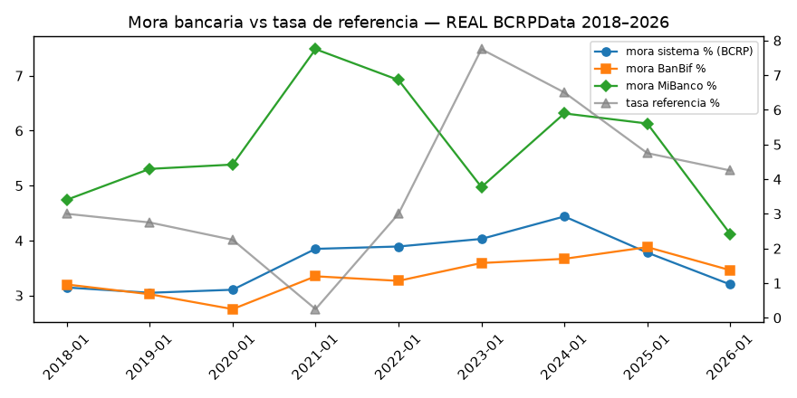
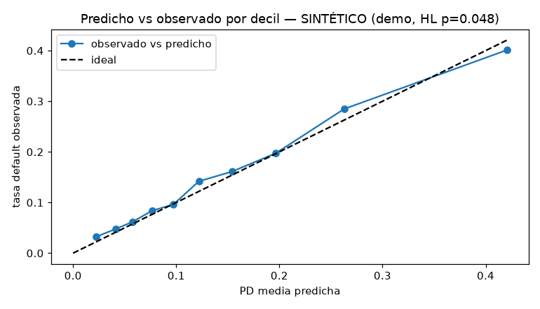
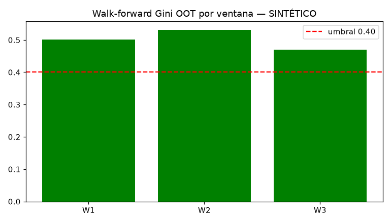
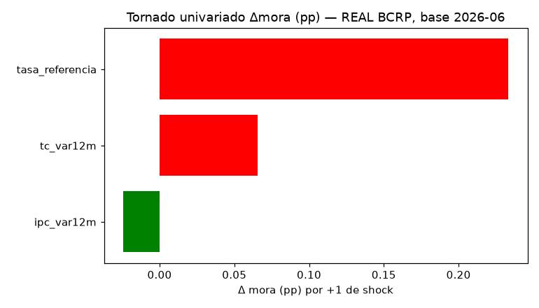

# Validación de modelos de riesgo de crédito con datos del Perú

Fábrica de validación (Gini/KS/PSI/backtesting/estrés) sobre agregados BCRP + laboratorio sintético para el método individual, porque no hay microdata SBS.

Trabajo de Ali Yury Cerna Enciso, bachiller en Economía (PUCP). Python 3.11.

Este repo tiene dos módulos que no se mezclan. **Módulo A (real):** mora y macro agregadas del BCRP/SBS → ETL medallion, estrés OLS, panel 2010–2026. **Módulo B (sintético):** 60,000 préstamos generados con semilla fija → scoring, Gini/KS, backtesting, PSI, walk-forward. El B existe porque el secreto bancario impide publicar préstamo a préstamo; demuestra método, no describe cartera alguna.

## Módulo A — agregados reales

La SBS publica mora y colocaciones agregadas por entidad, y el BCRP publica macro mensual. Cada serie está pineada con fecha y código en el propio repositorio, así que cualquier cifra se puede rastrear a su descarga.

La mora del sistema bancario cerró junio de 2026 en 2.85% (BanBif 3.12%, MiBanco 3.89%). La tasa de referencia anda en 4.25% y la expectativa de inflación a doce meses en 3.05%.

Encima corre un ETL medallion clásico: los CSV crudos entran inmutables a bronze, se validan con Pandera en silver (tipos, rangos, nulos, unicidad de periodo) y terminan en un panel mensual gold con linaje de cada tabla (hash del insumo y versión del código). El estrés es un satélite OLS de la mora contra tasa, inflación y tipo de cambio, con tres escenarios nombrados.
La mora por producto (consumo, hipotecario, microempresa) está fuera de
alcance: el portal de la SBS no tiene API pública y este repo no es una guía
de descarga. El estrés usa mora sistema.

## Módulo B — laboratorio sintético (método, no cartera)

Regresión logística como titular y gradient boosting solo de challenger, porque ante auditoría el modelo que se defiende es el explicable. Validación walk-forward en tres ventanas móviles, backtesting binomial por grado, PSI train contra fuera de muestra y simulación ilustrativa de migración de grados.

Un detalle honesto del diseño: desde 2025 el generador mete un beta-break que el modelo entrenado no vio — el bureau pierde pendiente fuera de muestra. Por eso el entrenamiento ordena mejor que la validación y un grado cae en rojo (AA, p=0.0003), con plan de acción que reestima coeficientes en vez de maquillar el intercepto. Preferí dejar esa deriva a la vista antes que presentar métricas perfectas.

Sus niveles son ilustrativos y no están anclados a la mora real: todo gráfico suyo va titulado "sintético".

## Resultados del build del 7 de setiembre de 2026

Módulo A: el estrés lleva la mora de 2.85% a 3.94% en el escenario adverso y a 4.80% en el severo (satélite OLS 2018–2026, R²=0.635, LGD 45% supuesto).

Módulo B: Gini 0.505 en entrenamiento y 0.470 fuera de muestra, KS 0.347, Brier 0.115. Backtesting con un grado en rojo y recalibración completa comprometida al 6 de diciembre.

El informe completo ([`informe/informe_validacion.md`](informe/informe_validacion.md), con sus siete secciones y anexos en Excel) se genera solo desde las tablas validadas. Metodología en [`docs/METODOLOGIA.md`](docs/METODOLOGIA.md), límites en [`docs/LIMITACIONES.md`](docs/LIMITACIONES.md), trazabilidad aviso → módulo en [`docs/FUENTES.md`](docs/FUENTES.md).

## Gráficos

La mora del sistema frente a la tasa de referencia, con datos reales del BCRP:



La calibración del modelo por decil (demo sintética) y su estabilidad en tres ventanas móviles:




Y cuánto se movería la mora ante cada shock macro por separado:



## Para correrlo

```bash
pip install -r requirements-lock.txt
python src/00_download.py --all
pytest -q
python src/01_build_medallion.py && python src/02_score_validate.py && python src/03_estres.py && python reporte/05_report_sbs.py
streamlit run app/streamlit_app.py
```

## Límites

La mora por producto está fuera de alcance, y el LGD de 45% es un supuesto declarado. Lo sintético solo prueba método individual con un nivel ilustrativo: no describe cartera alguna. Y el satélite de estrés es lineal y corto, con la inflación no significativa; un quiebre estructural lo deja fuera de rango. Todo esto está desarrollado en la sección 7 del informe.

## Cita

```bibtex
@misc{cerna2026creditrisklab,
  author = {Cerna Enciso, Ali Yury},
  title = {peru-credit-risk-validation-lab},
  year = {2026},
  note = {Agregados BCRPData/SBS + validación Gini/KS/PSI/backtesting/estrés}
}
```

Licencia MIT.
